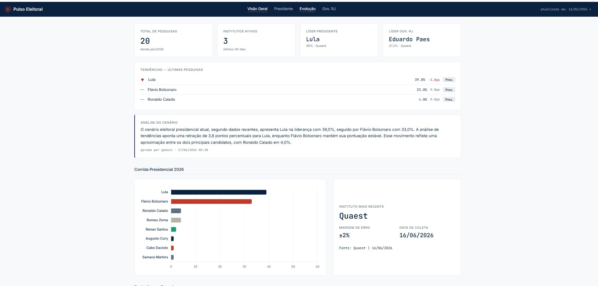

<div align="center">



<br/>

# Pulso Eleitoral

**PT:** Radar de pesquisas eleitorais brasileiras — coleta automática, análise com IA e dashboard público  
**EN:** Brazilian electoral polls radar — automated collection, AI analysis and public dashboard

<br/>

[](https://python.org)
[](LICENSE)
[](https://github.com/simoesleandro/Pulso-eleitoral/commits)
[](https://github.com/simoesleandro/Pulso-eleitoral/issues)
[](https://flask.palletsprojects.com)
[](https://aistudio.google.com)
[](https://pulso-eleitoral.fly.dev/dashboard)

<br/>

[🔗 Demo ao vivo](https://pulso-eleitoral.fly.dev/dashboard) &nbsp;·&nbsp;
[🐛 Reportar bug](https://github.com/simoesleandro/Pulso-eleitoral/issues) &nbsp;·&nbsp;
[💡 Sugerir feature](https://github.com/simoesleandro/Pulso-eleitoral/issues)

</div>

---

## 📋 Índice / Table of Contents

- [Sobre / About](#-sobre--about)
- [Demo](#-demo)
- [Funcionalidades / Features](#-funcionalidades--features)
- [Stack](#-stack)
- [Instalação / Setup](#-instalação--setup)
- [Variáveis de Ambiente / Environment Variables](#-variáveis-de-ambiente--environment-variables)
- [Arquitetura / Architecture](#-arquitetura--architecture)
- [Testes / Tests](#-testes--tests)
- [Roadmap](#-roadmap)
- [Autor / Author](#-autor--author)

---

## 📌 Sobre / About

**PT:**  
Pulso Eleitoral é um radar de pesquisas eleitorais para as eleições brasileiras de 2026. Coleta automaticamente dados de institutos como Quaest via Playwright + Gemini, armazena em SQLite e exibe em dashboard público com gráficos, tendências e análise de cenário gerada por IA. Deploy no Fly.io com coleta local agendada via Task Scheduler.

**EN:**  
Pulso Eleitoral is an electoral polls radar for the 2026 Brazilian elections. It automatically collects data from institutes like Quaest via Playwright + Gemini, stores it in SQLite and displays it in a public dashboard with charts, trends and AI-generated scenario analysis. Deployed on Fly.io with local scheduled collection via Task Scheduler.

---

## 🎯 Demo

🔗 **Ao vivo / Live:** [pulso-eleitoral.fly.dev/dashboard](https://pulso-eleitoral.fly.dev/dashboard)

<details>
<summary>📸 Screenshots</summary>
<br/>


</details>

---

## ✨ Funcionalidades / Features

> **PT:** Monitoramento contínuo do cenário eleitoral brasileiro com IA  
> **EN:** Continuous monitoring of the Brazilian electoral landscape with AI

- ✅ Coleta automática diária via Playwright + Gemini (Quaest)
- ✅ Dashboard público com gráficos Chart.js (Presidente + Gov. RJ)
- ✅ KPIs em tempo real — líder, tendências, institutos ativos
- ✅ Análise de cenário gerada por Gemini com cache de 6h
- ✅ Série histórica de intenções de voto por candidato
- ✅ Painel admin com gerenciamento de usuários (bcrypt)
- ✅ Notificações Telegram a cada nova coleta
- ✅ Deploy Fly.io + WinSW local (porta 5080)
- 🚧 Datafolha via Playwright *(em desenvolvimento / in progress)*
- 🚧 Integração Atlas Intel via PDF *(em desenvolvimento / in progress)*

---

## 🛠 Stack

| Camada / Layer | Tecnologia / Technology |
|----------------|------------------------|
| Backend | Python 3.11, Flask, Waitress |
| Frontend | HTML/CSS/JS, Chart.js 4 |
| Banco de dados / Database | SQLite |
| IA / AI | Gemini 2.5 Flash (google-genai) |
| Scraping | Playwright, BeautifulSoup4, lxml |
| Deploy | Fly.io (região GRU) |
| Testes / Tests | pytest (61 testes) |

---

## 🚀 Instalação / Setup

### Pré-requisitos / Prerequisites

- Python 3.11+
- pip
- Playwright (`python -m playwright install chromium`)

### Instalação / Installation

```bash
# Clone o repositório / Clone the repository
git clone https://github.com/simoesleandro/Pulso-eleitoral
cd Pulso-eleitoral

# Instale as dependências / Install dependencies
pip install -r requirements.txt
python -m playwright install chromium

# Configure as variáveis de ambiente / Set up environment variables
cp .env.example .env
# Edite .env com suas chaves / Edit .env with your keys

# Inicialize o banco / Initialize the database
python -c "import database; database.init_db()"

# Rode o projeto / Run the project
python app.py
```

---

## 💻 Uso / Usage

### Coleta manual de pesquisas

```bash
python coletar.py
```

### Sincronizar banco local com Fly.io

```bash
python scripts/sync_db.py
```

---

## 🔐 Variáveis de Ambiente / Environment Variables

| Variável | Descrição / Description | Padrão / Default |
|----------|------------------------|-----------------|
| `GEMINI_API_KEY` | Chave API Google Gemini | — |
| `TELEGRAM_BOT_TOKEN` | Token do bot Telegram | — |
| `TELEGRAM_CHAT_ID` | Chat ID para notificações | — |
| `ADMIN_PASS` | Senha do usuário admin | `pulso2026` |
| `SECRET_KEY` | Chave secreta Flask session | — |

> Lista completa em / Full list in: [`.env.example`](.env.example)

---

## 🏗 Arquitetura / Architecture

```
Pulso-eleitoral/
├── collectors/          # Coletores por instituto (Quaest, Atlas, Poder360)
├── static/css/          # Design system (tokens.css, base.css)
├── static/js/           # Chart.js helpers (charts.js)
├── templates/           # Dashboard, login, admin
├── tests/               # 61 testes pytest
├── scripts/             # sync_db.py (local → Fly.io)
├── app.py               # Flask + rotas + APScheduler
├── database.py          # SQLite helpers
├── coletar.py           # Script standalone de coleta
└── notifier.py          # Notificações Telegram
```

**Fluxo principal / Main flow:**

```
Task Scheduler (10h) → coletar.py
      ↓
Playwright abre browser → coleta HTML do instituto
      ↓
Gemini 2.5 Flash extrai candidatos + percentuais
      ↓
SQLite (pesquisas + intencoes)
      ↓
scripts/sync_db.py → Fly.io /data/pulso.db
      ↓
Dashboard público (pulso-eleitoral.fly.dev)
```

---

## 🧪 Testes / Tests

```bash
# Rodar todos os testes / Run all tests
pytest

# Com cobertura / With coverage
pytest --cov=. --cov-report=term-missing

# Teste específico / Specific test
pytest tests/test_dashboard.py -v
```

> **61 testes** cobrindo coletores, dashboard, banco, scheduler, notificações e usuários.

---

## 🗺 Roadmap

- [x] Scraper Quaest com Playwright + Gemini
- [x] Dashboard público Chart.js
- [x] Deploy Fly.io
- [x] Análise de cenário com Gemini (cache 6h)
- [x] Notificações Telegram
- [x] Sistema de usuários com bcrypt
- [ ] Datafolha via Playwright
- [ ] Atlas Intel via PDF
- [ ] Dados regionais (mapa por estado)
- [ ] Probabilidade de 2º turno

---

## 👤 Autor / Author

<div align="center">

**Leandro Simões**

[](https://linkedin.com/in/leandro-sim%C3%B5es-7a0b3537b)
[](https://github.com/simoesleandro)
[](https://simoesleandro.github.io/portfolio)

*Fullstack · IA Aplicada · Civic Tech*

</div>

---

<div align="center">

Feito com ☕ e IA em / Made with ☕ and AI in 🇧🇷 Rio de Janeiro

</div>
